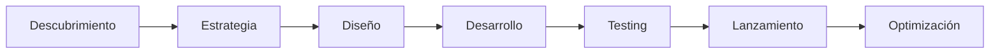

# 🎨 Graph - Agencia Digital

### Transformamos ideas en experiencias digitales excepcionales

[🌐 Sitio Web](https://graph.com.ar) • [📧 Contacto](mailto:info@graph.com.ar) • [💼 Portfolio](https://graph.com.ar/portfolio)

---

## 🚀 Sobre Nosotros

Somos **Graph**, una agencia digital especializada en crear soluciones digitales innovadoras que impulsan el crecimiento de tu negocio. Con un equipo multidisciplinario de diseñadores, desarrolladores y estrategas digitales, transformamos ideas en productos digitales de alto impacto.

Creemos en la innovación, la excelencia técnica y el diseño que marca la diferencia. Cada proyecto es una oportunidad para superar expectativas y crear experiencias digitales memorables.

## 💼 Nuestros Servicios

<table>
<tr>
<td width="50%">

### 🎨 Diseño & Branding
- Identidad visual corporativa
- Diseño de UI/UX
- Material gráfico y publicitario
- Branding estratégico
- Manual de identidad

</td>
<td width="50%">

### 💻 Desarrollo Web
- Sitios web responsive
- E-commerce a medida
- Aplicaciones web progresivas
- Landing pages de alta conversión
- Optimización SEO

</td>
</tr>
<tr>
<td width="50%">

### 📱 Social Media
- Gestión integral de redes sociales
- Estrategia de contenidos
- Community management
- Publicidad digital (Meta Ads, Google Ads)
- Análisis de métricas

</td>
<td width="50%">

### ⚙️ Software a Medida
- Aplicaciones empresariales
- Sistemas de gestión (CRM, ERP)
- APIs y automatizaciones
- Integración de sistemas
- Consultoría técnica

</td>
</tr>
</table>

## 🛠️ Tecnologías que Usamos

### Frontend

### Backend & Database

### Diseño & Tools

## 📊 Nuestros Proyectos Destacados

Explora algunos de nuestros trabajos y proyectos open source:

- **[graph-page](https://github.com/Graph/graph-page)** - Nuestro sitio web corporativo con View Transitions API y React 19
- **[portfolio](https://github.com/Graph/portfolio)** - Portfolio interactivo con animaciones modernas
- **[luzyvida-landing](https://github.com/Graph/luzyvida-landing)** - Landing page profesional para cliente destacado

## 🌟 Por qué Elegirnos

- ✅ **Experiencia Comprobada** - Años de trayectoria en el mercado digital
- ✅ **Tecnología de Vanguardia** - Siempre usamos las últimas tecnologías
- ✅ **Diseño Personalizado** - Cada proyecto es único y a medida
- ✅ **Soporte Continuo** - Acompañamiento post-lanzamiento
- ✅ **Resultados Medibles** - Enfoque en ROI y conversiones
- ✅ **Metodología Ágil** - Entregas rápidas e iterativas

## 💡 Nuestro Proceso

1. **Descubrimiento** - Entendemos tu negocio y objetivos
2. **Estrategia** - Planificamos la solución óptima
3. **Diseño** - Creamos interfaces atractivas y funcionales
4. **Desarrollo** - Programamos con las mejores prácticas
5. **Testing** - Aseguramos calidad en cada detalle
6. **Lanzamiento** - Publicamos tu proyecto al mundo
7. **Optimización** - Mejoramos continuamente basados en datos

## 🤝 Trabaja con Nosotros

¿Tienes un proyecto en mente? ¡Nos encantaría ser parte de tu éxito digital!

### 📞 Contáctanos

📧 **Email:** info@graph.com.ar  
📱 **WhatsApp:** +54 9 11 XXXX-XXXX  
🌐 **Web:** [graph.com.ar](https://graph.com.ar)  
📍 **Ubicación:** Buenos Aires, Argentina

[💬 Iniciar Conversación](https://wa.me/5491234567890) • [📋 Ver Portfolio](https://graph.com.ar/portfolio) • [📝 Pedir Cotización](mailto:info@graph.com.ar)

## 👥 Nuestro Equipo

Somos un equipo apasionado por el diseño, la tecnología y la innovación. Creemos en:

- 🎯 La colaboración como motor de grandes proyectos
- 📚 El aprendizaje continuo y la mejora constante
- 💡 La creatividad sin límites
- 🚀 La entrega de valor real a nuestros clientes
- ❤️ Hacer lo que amamos con excelencia

## 📈 Estadísticas

## 🎓 Recursos y Blog

Compartimos conocimiento con la comunidad:

- 📝 Artículos sobre desarrollo web moderno
- 🎥 Tutoriales y casos de estudio
- 💻 Snippets de código útiles
- 🎨 Tips de diseño y UX

---

**© 2026 Graph Agencia Digital**  
*Hecho con ❤️, ☕ y mucho código en Buenos Aires, Argentina*

**Síguenos en redes sociales**  
[Instagram](https://instagram.com/graph) • [LinkedIn](https://linkedin.com/company/graph) • [Behance](https://behance.net/graph)

